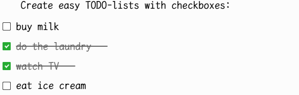

## [Blue-theme](https://github.com/SiriusXT/trilium-theme-blue)

## Updated 
1. Version:0.13 For trilium-NEXT:>=0.92.4

> **Important**:
 Currently, the TriliumNext theme has been set as the base theme. The **blue theme** needs to be assigned the tag `#appTheme=blue-theme-light #appThemeBase=next-light`, and the **blue-theme-dark** needs `#appTheme=blue-theme-dark #appThemeBase=next-dark`.  
 Alternatively, you can directly import `blue-theme.zip` from **Releases**, which includes `blue-theme.css`, `blue-theme-dark-theme.css`, and `Dark-mode-img-color-conversion.js`.

2. Automatically apply a strikethrough to the text following a checked checkbox

## Features

1. Blue Theme 
2. **More compact**, line spacing, paragraph spacing, etc. 
3. Indent the first line and align both ends. 
4. The directory tree mouse displays the background color when hovering to highlight the selected folder.
5. Tree style.
6. **Title style of H1, H2, H3 and H4 . **
7. Other changes.

## Usage

1. Create a CSS code note in Trilium and name it `Blue-theme`
2. Paste the content from `Blue-theme.css` in it
3. Add the `#appTheme=blue-theme-light #appThemeBase=next-light` attribute to it
4. Go to Menu > Options, and select Blue-theme as your new theme
5. Ctrl + R to reload

8. **If you use the dark mode theme, you can use the 'Dark-mode-img-color-conversion.js' script to invert the color of the white image to fit the dark mode.** Remember to give Dark-mode-img-color-conversion.js Script to add #widget tag. *You can add the **#disableAdjustImage** tag to the note if you don’t want the color of a certain note image to be inverted.*

## Tips

Using the shortcut key `enter`is to create a new paragraph, and this method will automatically indent the first line; using the shortcut key `enter+shift` is a line break, and this method will not indent the first line.

