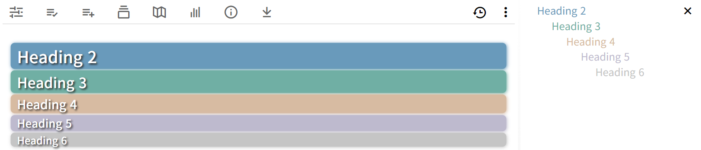
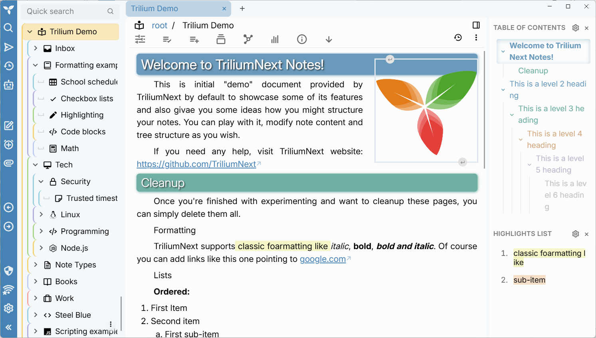
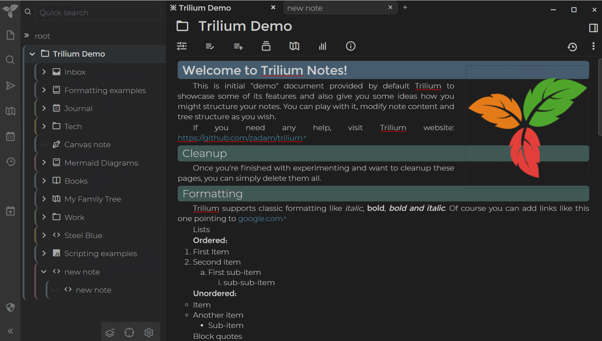

## [Blue-theme](https://github.com/SiriusXT/trilium-theme-blue)

## Updated 
1. Version:0.9 For trilium-NEXT:>=0.90.8
   Dark-mode-img-color-conversion.js version:0.10
2. Optional: Change the font to `SourceHanSansSC`.
    The default font is relatively thin, and `SourceHanSansSC` is thicker, which is easier to browse.    
    Configuration method: import note `font-style.zip` directly.( See the screenshot at the end.)
3. New heading and TOC style
   
4. Added blue-theme-dark-mode.css.
   **If you use the dark mode theme, you can use the 'Dark-mode-img-color-conversion.js' script to invert the color of the white image to fit the dark mode.** Remember to give Dark-mode-img-color-conversion.js Script to add #widget tag. *You can add the **#disableAdjustImage** tag to the note if you don’t want the color of a certain note image to be inverted.*

## Features

1. Blue Theme 
2. **More compact**, line spacing, paragraph spacing, etc. 
3. Indent the first line and align both ends. 
4. The directory tree mouse displays the background color when hovering to highlight the selected folder.
5. Tree style.
6. **Title style of H1, H2, H3 and H4 . **
7. More obvious scroll bar.
8. Expand the background image of the tree. 
9. Other changes.

## Usage

1. Create a CSS code note in Trilium and name it `Blue-theme`
2. Paste the content from `Blue-theme.css` in it
3. Add the `#appTheme=Blue-theme` attribute to it
4. Download the `background.png` , then right-click on the note and select Import to note
5. Add the attribute `#originalFileName=background.png #customResourceProvider=background.png` to `background.png`
6. Go to Menu > Options, and select Blue-theme as your new theme
7. Ctrl + R to reload

## Tips

Using the shortcut key `enter`is to create a new paragraph, and this method will automatically indent the first line; using the shortcut key `enter+shift` is a line break, and this method will not indent the first line.

